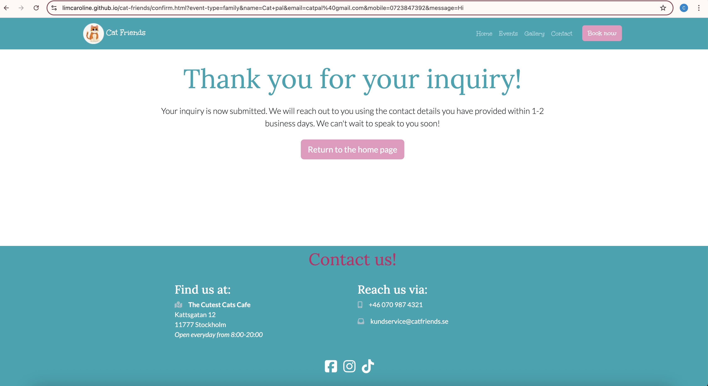

**The Cat Band Website**

**Table of Contents**

Project Overview

Purpose
- Business Goals
- Target Users
- User Needs

User Stories Overview

Website Structure
- Menu
- Wireframes 

Features

Technologies Used

Deployment & Local Development

Testing

Credits

**Project Overview**

Welcome to the official website repository for Cat Friends – the cutest feline musical group hanging out at The Cutest Cats café, performing at concerts, and now also dropping by private events. This project is a simple website created to showcase the band, provide event information, and handle bookings. It provides visitors access to event schedules, booking information, and a gallery of previous shows. 

This website is built with HTML and CSS, responsive, and easy to navigate.

**Purpose**

Business Goals
- Increase awareness and visibility 
- Drive revenue through ticketed events and private bookings 
- Support the cat café with increased foot traffic and reach mutual brand benefit

Target Users
- Cat lovers and animal café fans  
- Music lovers who enjoy novelty acts  
- Event planners booking live acts  

User Needs
- Check schedules of shows and appearances
- Have access to easy booking and contact options   
- Learn about the band  

**User Stories Overview**
Stories have been updated in https://github.com/users/limcaroline/projects/4. Here is an initial overview:

1. Navigate Easily  
As a user, I want clear navigation.  
Navbar includes Home, Events, Gallery, Contact, Booking.

2. Check Events  
As a visitor, I want to see upcoming shows so I can attend.  
Events are shown with details and sorted by date.

3. Book the Band  
As an event planner, I want to easily book the Cat Band.  
Booking form or email contact is clearly available.

4. Contact the Band 
As a fan, I want to learn about the band and its members.  
About page includes bio of band and its members.

5. View Gallery  
As a visitor, I want to see photos and similar media.  
Gallery page is responsive and organized.

**Website Structure**

Menu
- Home: Welcome message
- Events: List with description of café, concert, and private events 
- Gallery: Photos and similar media 
- Contact: Contact details - location, opening hours, phone/email, social links
- Booking: Book the band 

Wireframes

**Features**

- Responsive layout using CSS - mobile, tablets, laptops, desktop, larger desktops
- Navigation bar for easy browsing  

- Event listings in card and list format  
Card format for overview

List format for actual events (many/more than overview)

- Simple HTML contact/booking form with validation and success confirmation

- Responsive image gallery

- Designed with on-brand color palette and font styles
I used the below color palette from IMAGECOLORPICKER.com

**Technologies Used**
Languages Used
- HTML  
- CSS  

**Frameworks, Libraries & Programs Used**
- Github for saving and storing files, and version control
- Bootstap Version 5.3 for styling/layout
- Google Fonts for typography
- Font Awesome for icons
- Autoprefixer for CSS versatility
- The W3C CSS Validation Service to review codes
- Nu Html Checker to review codes
- WebAIM: Contrast Checker to verify contrast for color palette
- IMAGECOLORPICKER.com to choose color palette
- VS Code for local development 
- Canva for images
- Preview Editor app for editing photos
- Squoosh for converting image file types from png/jpg to. webp

**Deployment & Local Development**
Github Repo: https://github.com/limcaroline/cat-friends

How to create repo in Github for deployments
I first followed these steps from Code Institute module to create a repo in github:
1. Log into www.github.com. Click the plus icon and select New repository.
2. Name the repository accordingly - I used cat-friends.
3. Select Create repository.
4. Copy the commands from … or create a new repository on the command line.
5. In VS Code, use "Open folder" from the file menu to open your vscode-projects folder and create a new project directory.
6. Open a new terminal, and paste in the commands copied from GitHub.
7. You should now see the README.md file appear in the Explorer.

How to Deploy
These are the steps to deploy in github that I followed, also referenced from Code Institute's module:
1. From VSCode, commit and push all your changes to Github.
2. Go to GitHub repo https://github.com/limcaroline/cat-friends, select Settings, then Pages.
3. Select the main branch and then Save.
4. In the Code tab, select Deployments.
5. On the Deployments page, refresh until the link is provided.
6. Click the link to check that it is working

How to Fork
1. In Github, go to the Repository for cat-friends: https://github.com/limcaroline/cat-friends
2. Click the Fork button at the top right of this page to create your own copy of the repo.

How to Clone
1. In Github, go to the Repository for cat-friends: https://github.com/limcaroline/cat-friends
2. Click the green Code button.
3. Copy the URL under "HTTPS".
4. Open your terminal.
5. Run this command: git clone https://github.com/limcaroline/cat-friends

**Testing**
I have followed the testing steps laid out by Code Institute in the Boardwalk Games module. Here I have copied their instructions as a checklist as I have done these step by step:

Manual testing
- Manually test the pages for responsiveness, functionality and user experience.

Automated testing
- Use Lighthouse to create automated reports that assess the performance, accessibility and best practices of the pages.
I have gotten the results to green particularly on performance by changing the image file types from png/jpg to webp. Also updated the color contrast and put some styling in bold in parts like navigation menu and buttons.

- Validate the HTML code for all 3 pages. >> Fixed few errors such as unclosed elements and warnings such as lacking headers. See screenshots for example.

Validation testing
Note: Also used autoprefixer and CSS validation >> Copy pasted from autofixer for the transition code for social links, similar to what was done in Boardwalk Games which I have followed through this project. All CSS ok. 

- For any issues indicated during testing, assess the feasibility of fixing them.
- Fix any issues that are feasible to fix. (Note that the screenshots above show the "before fix" and "after fix")

**Future Implementation**
- Add an About page describing the band and its member profiles. This is a user story existing as could-have in the To-Do list in the cat-friend repo.
- Add a Ticket booking and payment sections.

**Credits**

Content
- I wrote the content with support - see 'Acknowledgments' below.

Media
- See also **Frameworks, Libraries & Programs Used** 
- Canva for images 
- Bootstap Version 5.3 for styling/layout
- Google Fonts for typography
- Font Awesome for icons

Acknowledgments
- Big thanks to Code Institute’s team as well as materials and Level 5 Diploma in Web Application Development modules, especially Love Running and Boardwalk Games, on which I have referred to a lot in the building of the entire project from planning to coding to documenting. I have learned so much from the modules that I have been able to apply to this project. These materials have given me a great base for learning, best practices, and more knowledge. Thank you CI team for your support and hard work - much, much appreciated! 
- Special thanks to ChatGPT by OpenAI for assistance in troubleshooting and debugging, as well as support in ideas and structure especially in documenting this project.
- Thank you to all the mentioned in this readme and in VScode (especially the comments) that was helpful in making this project!

